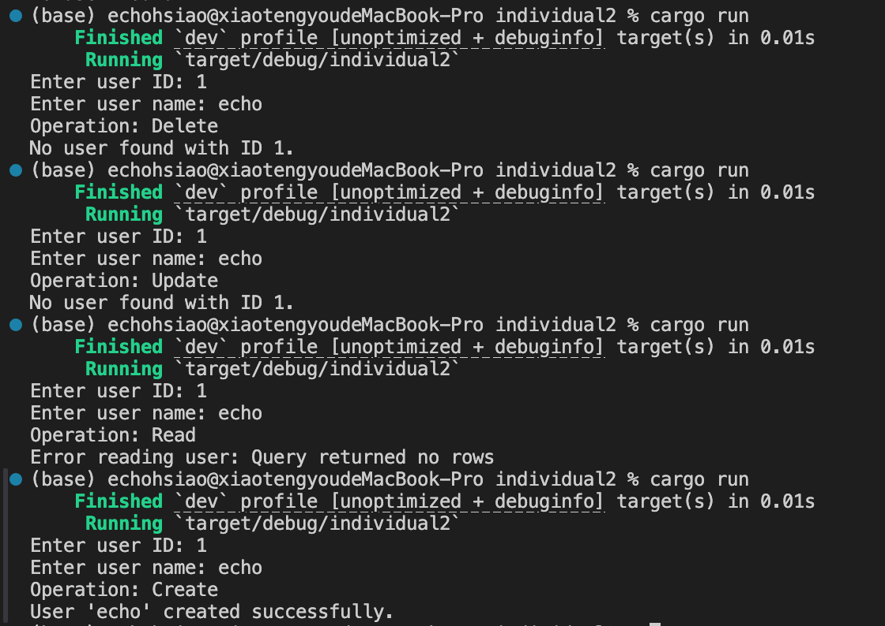

[](https://github.com/EchoHsiao7/TengyuHsiao_IDS_Ind2/actions/workflows/CI.yml)
# TengyuHsiao_IDS_Individual2

## Rust SQLite CRUD Application

This project is a simple Rust application that demonstrates basic CRUD (Create, Read, Update, Delete) operations using a SQLite database. The program prompts the user to enter a user ID and name, then randomly performs one of the CRUD operations and displays the result.

**The following is a example output showing CRUD operations:**



## How to Run the Program


1. **Clone the Repository** :

   If the code is hosted on a repository like GitHub or GitLab, clone it using:

   ```bash
   git clone https://github.com/EchoHsiao7/TengyuHsiao_IDS_Ind2.git
   cd individual2

2. **Download Rust** :

    Download and install Rust from the official website: https://www.rust-lang.org/tools/install

3. **Build the project** :

   ```bash
   cargo build --release


4. **Run the project** :

   ```bash
   cargo run --release

